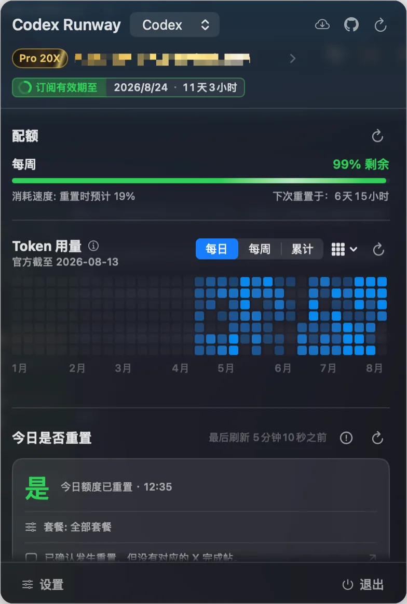
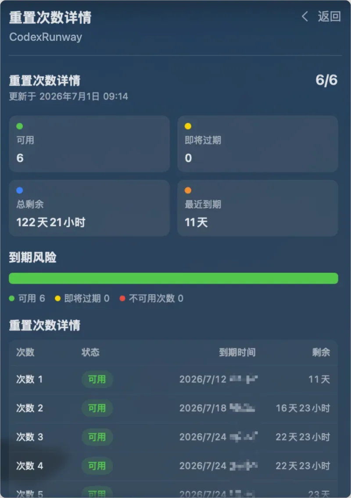
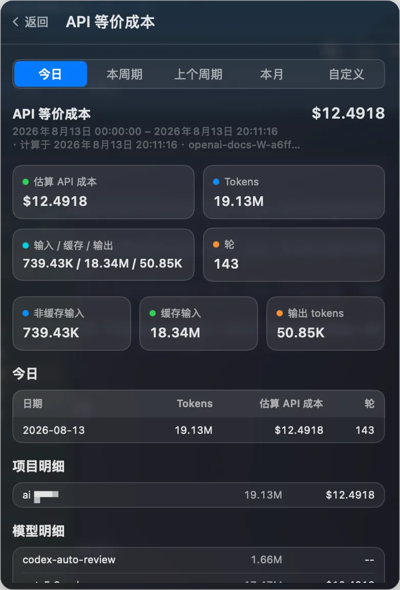
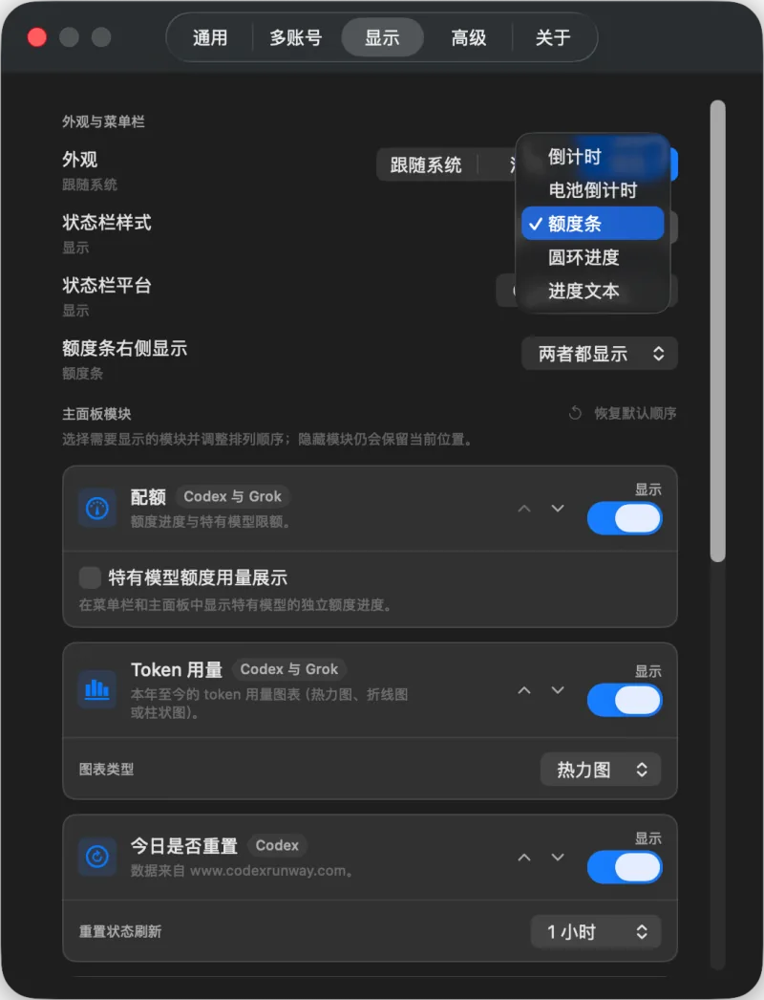
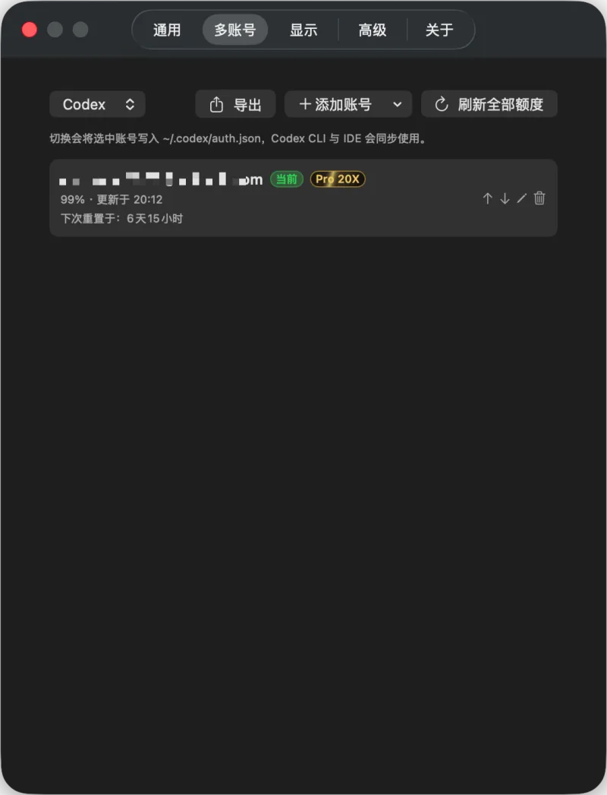
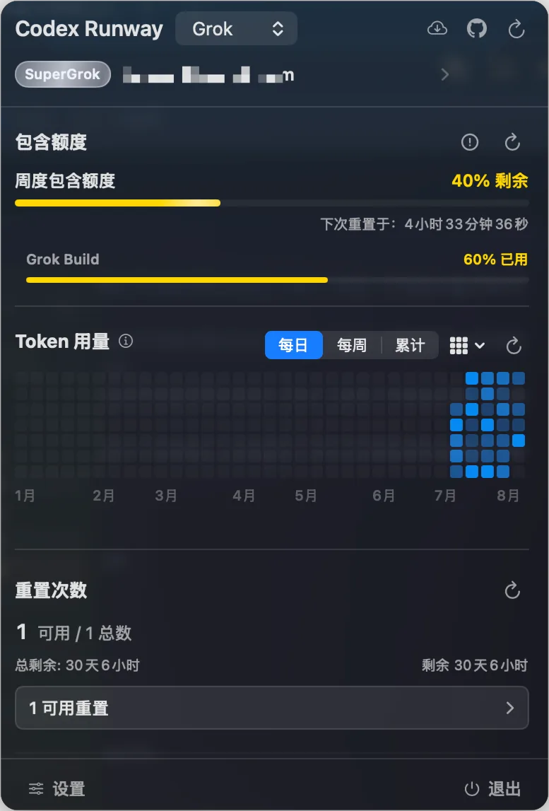

[English](./README.md) · [简体中文](./README_ZH.md) · [繁體中文](./README_ZH_HANT.md) · 한국어 · [日本語](./README_JA.md) · [Русский](./README_RU.md) · [Français](./README_FR.md)

<p align="center">
  
</p>

# Codex Runway

Codex가 얼마나 더 달릴 수 있을까요?

Codex Runway는 Codex와 Grok 할당량을 확인하는 네이티브 macOS 메뉴 막대 앱입니다. Codex의 오늘 리셋 여부, reset credits, API 환산 비용, 로컬 세션과 공급자별 다중 계정 관리를 제공합니다.

## 주요 기능

- 메뉴 막대에서 Codex 남은 할당량을 확인합니다.
- 항상 보이는 `Codex | Grok` 탭으로 전환하면 메뉴 막대와 컨텍스트 메뉴가 선택한 공급자를 따릅니다.
- 공식 CLI chat-proxy 결제 API로 Grok 포함 할당량, 제품 분해(Build / Imagine / Chat), 주/월 주기, 선불 잔액, 온디맨드 사용량을 봅니다.
- Grok 패널에서도 Codex와 같은 Token 사용량 차트(히트맵 / 꺾은선 / 막대)와 API 환산 비용 모듈, Grok CLI 로그의 최근 로컬 세션을 사용합니다.
- 여러 Grok OAuth / SuperGrok 계정을 격리 로그인, 현재 로그인 가져오기, 토큰/JSON 붙여넣기, 새로고침, 별칭, 정렬, 제거, 명시적 전환으로 관리합니다.
- 5시간, 주간 및 추가 할당량 창을 봅니다.
- 오늘 Codex 속도 제한이 리셋되었는지 확인합니다([www.codexrunway.com](https://www.codexrunway.com) 데이터, 관련 공개 게시물 링크 포함).
- 설정에서 「오늘 리셋되었나요?」 섹션을 켜고 자체 새로고침 간격을 구성합니다(기본값: 켜짐, 1시간).
- 여러 Codex 계정을 관리합니다: 브라우저 로그인, 로컬 `auth.json` 가져오기, 토큰/JSON 붙여넣기(`/auth/session` 포함), 파일 가져오기, API 키 추가.
- 확인 후 `~/.codex/auth.json`을 원자적으로 써서 안전하게 전환하고, CLI / IDE 동기화를 위해 Codex를 바로 재시작할 수 있습니다.
- 현재 계정, 구독 등급, 만료를 표시합니다.
- 리셋 크레딧 수, 상태, 만료 시각을 봅니다.
- 오늘, 현재 주기, 이전 주기, 이번 달 또는 사용자 지정 범위의 API 환산 비용과 토큰 사용량을 봅니다. 기본 범위는 설정에서 바꿀 수 있습니다.
- 메인 패널 할당량 아래에 연초부터의 토큰 사용량 차트(히트맵 / 꺾은선 / 막대, 일간 / 주간 / 누적)를 표시합니다. 스타일은 패널과 설정에서 바꿀 수 있으며 기본값은 히트맵입니다.
- 로컬 증분 세션 인덱스로 비용 스캔을 빠르게 합니다.
- 최근 Codex 세션, 프로젝트, 상태, 사용량 요약을 봅니다.
- 로컬 세션 인덱스를 복구합니다.
- 라이트, 다크, 시스템 모양과 English, 简体中文, 繁體中文, 한국어, 日本語, Русский, Français를 지원합니다.
- 내장 업데이트 확인을 지원합니다.
- macOS 14+ 데스크톱 위젯으로 할당량 개요, 토큰 추세, 핵심 지표, 오늘 리셋 상태를 제공합니다.

## 스크린샷

<p align="center">
  
  
  
  
  
  
</p>

## 설치

### Homebrew (권장)

프로젝트에서 유지하는 [Licoy Homebrew Tap](https://github.com/Licoy/homebrew-tap)에서 설치합니다:

```bash
brew install --cask licoy/tap/codex-runway
```

Codex Runway는 앱 내 업데이트도 지원합니다. Homebrew가 업그레이드를 확인하고 설치하게 하려면:

```bash
brew upgrade --cask --greedy codex-runway
```

제거 시 기본적으로 설정과 관리 계정 사본은 유지됩니다. `--zap`을 추가하면 `~/.codex-runway` 데이터도 지우지만 공식 `~/.codex`나 `~/.grok` 디렉터리 또는 세션은 삭제하지 않습니다:

```bash
brew uninstall --cask codex-runway
brew uninstall --cask --zap codex-runway
```

### 수동 설치

[GitHub Releases](https://github.com/Licoy/codex-runway/releases)에서 Mac에 맞는 DMG를 받습니다:

- Apple Silicon: `CodexRunway-macos-arm64.dmg`
- Intel: `CodexRunway-macos-x86_64.dmg`

DMG를 열고 `CodexRunway.app`을 `Applications`로 끌어다 놓거나, 같은 아키텍처의 ZIP을 받아 풉니다.

### macOS 보안 차단

현재 릴리스는 ad-hoc signed이며 notarized되지 않았습니다. 개발자를 확인할 수 없거나 악성 소프트웨어 검사가 되지 않았다는 메시지가 나오면 `CodexRunway.app`을 Control-클릭한 뒤 열기를 선택하거나, 시스템 설정 > 개인 정보 보호 및 보안에서 그래도 열기를 클릭하세요.

`CodexRunway.app`이 손상되어 휴지통으로 옮겨야 한다는 메시지는 보통 다운로드 격리 속성입니다. 앱을 `Applications`에 넣은 뒤 다음을 실행하세요:

```bash
xattr -dr com.apple.quarantine /Applications/CodexRunway.app
```

그런 다음 앱을 다시 엽니다.

## 요구 사항

- macOS 12+
- 이 Mac에 Codex가 설치되어 사용 중인 것을 권장합니다
- 로컬 `~/.codex/auth.json`에서 가져오거나 앱에서 계정을 추가합니다(브라우저 로그인, 자격 증명 붙여넣기, 파일 가져오기 등)
- Grok 패널을 쓰기 전에 [공식 Grok CLI](https://docs.x.ai/build/overview)를 설치하세요:

  ```bash
  curl -fsSL https://x.ai/cli/install.sh | bash
  ```

- Grok 계정 관리와 결제는 OAuth / SuperGrok 및 호환 레거시 세션만 지원합니다. `grok login --oauth`를 실행하거나 앱에서 로그인, 현재 로그인 가져오기, `~/.grok/auth.json` / 자격 증명 JSON 붙여넣기를 사용하세요. API 키만 있는 자격 증명은 관리 계정으로 추가되지 않습니다.
- `GROK_HOME`이 설정되어 있으면 그 디렉터리를 쓰고, 아니면 `~/.grok`를 씁니다. [xAI Settings](https://docs.x.ai/build/settings)를 참고하세요.

## 로컬 실행

```bash
swift run CodexRunway
```

macOS 14+에서는 이 명령이 별도의 `Codex Runway Dev` 앱과 Widget 확장을 빌드·등록한 뒤 실행합니다. 개발 앱은 `.build/codex-runway-widget-dev/CodexRunway-dev.app`에 있으며 시스템 위젯 갤러리에서 바로 추가할 수 있습니다. 다른 Codex Runway 인스턴스는 먼저 종료하세요. 위젯 없이 패키징되지 않은 명령줄 프로세스만 쓰려면 `CODEX_RUNWAY_DISABLE_DEV_APP=1`을 설정하세요.

자가 진단:

```bash
swift run CodexRunway --self-check
```

자가 진단은 로컬 상태만 읽고 네트워크 요청을 하지 않습니다. 마스킹된 Codex 진단과 Grok CLI 버전, 자격 증명 상태, 계정 신원을 출력합니다. 토큰과 API 키는 절대 출력하지 않습니다.

## 데스크톱 위젯

데스크톱 위젯은 macOS 14 이상이 필요합니다. 이 수정이 포함된 버전부터 공개 릴리스와 로컬 개발 빌드 모두 Widget 확장을 포함합니다. 각 위젯은 위젯 편집에서 Codex, Grok 또는 둘 다를 독립적으로 고를 수 있습니다. 오늘 리셋은 Codex 전용입니다. 업그레이드 후 macOS는 앱의 `Contents/PlugIns`에서 프로덕션 위젯을 등록합니다.

`swift run CodexRunway`는 별도의 `swift-dev` 식별자를 쓰며 기존 설치를 바꾸지 않습니다. `.dev` 식별자로 위젯이 포함된 앱을 직접 패키징할 수도 있습니다:

```bash
INCLUDE_WIDGET=1 \
RUNWAY_BUNDLE_ID=com.github.codex-runway.dev \
RUNWAY_APP_GROUP_ID=group.com.github.codex-runway.dev \
RUNWAY_WIDGET_STORAGE_MODE=local \
bash Scripts/package-app.sh
```

앱은 `dist/CodexRunway.app`에 기록됩니다. 이 수정이 포함된 공개 릴리스와 로컬 ad-hoc 빌드는 `0600` 권한의 읽기 전용 버전 스냅샷 `~/.codex-runway/widget-snapshot.json`을 사용합니다. 등록된 App Group이 있는 Developer ID 빌드는 `RUNWAY_WIDGET_STORAGE_MODE=app-group`을 쓸 수 있습니다. 스냅샷에는 이메일, 계정 ID, 토큰, 인증 JSON, 외부 이벤트 원문이 없습니다. Developer ID 서명, App Group 등록, 공증은 이후 배포 작업으로 남아 있습니다.

## 개인정보

- 토큰은 로컬 `~/.codex/auth.json`에서 읽습니다. 다중 계정 자격 증명은 `~/.codex-runway/accounts/<id>/auth.json`에만 저장됩니다(디렉터리 `0700`, 파일 `0600`). 계정 인덱스 `index.json`에는 토큰이 없습니다.
- 공식 Grok 자격 증명은 `$GROK_HOME/auth.json`(미설정 시 `~/.grok/auth.json`)에서 읽습니다. 관리 사본은 `~/.codex-runway/accounts/grok-<stable-id>/auth.json`에 디렉터리 `0700`, 파일 `0600`으로 두고, 별도의 `~/.codex-runway/accounts/grok-index.json`에는 토큰이 없습니다.
- Grok 할당량은 로컬 OAuth 자격 증명으로 공식 CLI chat-proxy `/v1/billing?format=credits` 엔드포인트(Grok CLI와 동일한 공식 API)에 요청합니다. 앱은 브라우저 쿠키를 읽지 않으며 로컬 세션에서 가짜 할당량을 추정하지 않습니다.
- 현재 Grok 계정을 새로고침하는 동안 공식 CLI가 토큰을 회전할 수 있습니다. 앱은 결과 공식 자격 증명을 해당 관리 계정에만 반영합니다. 현재가 아닌 계정은 격리된 `GROK_HOME`을 쓰며 공식 자격 증명을 쓰지 않습니다.
- Grok 계정 전환은 공식 자격 증명의 OAuth / 호환 레거시 로그인 범위만 바꾸고 API 키와 알 수 없는 범위는 유지합니다. 전환은 새 세션에만 보장됩니다. 실행 중인 Grok 프로세스는 종료되지 않으며 이전 계정을 다시 쓸 수 있으므로 계속하기 전에 강한 경고를 보여 줍니다.
- 공식 `~/.codex/auth.json`은 계정 전환을 확인할 때만 원자적으로 덮어써서 Codex CLI / IDE가 동기화됩니다.
- 비활성 관리 계정을 새로고침하면 라이브러리 사본만 업데이트하고 공식 `auth.json`은 쓰지 않습니다. 활성 계정을 새로고침하면 공식 auth와 라이브러리 사본을 함께 맞춥니다.
- 잘못되었거나 mock 자격 증명은 공식 `~/.codex/auth.json`에 다시 쓰지 않습니다.
- 액세스 토큰, 리프레시 토큰, ID 토큰, API 키는 로그, README, 이슈 템플릿, 자가 진단 출력에 쓰지 않습니다.
- API 환산 비용은 기본적으로 로컬 세션 JSONL 로그에서 계산하며, `~/.codex-runway/` 아래 로컬 증분 인덱스 같은 파생 데이터를 둡니다. 세션 내용은 업로드하지 않습니다.
- 온라인 사용량은 로컬 토큰 데이터가 없을 때만 API 환산 비용을 보완합니다. 차트의 「공식 통계(모든 기기)」는 현재 계정 프로필 통계이며 지연되거나 수정될 수 있습니다. 「로컬 로그(모든 세션)」는 이 Mac의 세션을 스캔하며 기록이 여러 계정에 걸칠 수 있습니다. 두 계열은 부분집합 관계가 아니므로 빼면 안 됩니다.
- 세션 복구는 `~/.codex/session_index.jsonl`만 다루고, 쓰기 전에 백업을 만들며 세션 파일은 삭제하지 않습니다.
- 「오늘 리셋되었나요?」는 공개 상태 피드만 다운로드합니다. Codex 계정, 토큰, 로컬 세션 내용은 보내지 않습니다.
- 업데이트 확인은 버전 정보만 요청합니다. Codex 계정과 세션 데이터는 업로드하지 않습니다.
- 위젯 스냅샷에는 비밀이 아닌 파생 할당량, 잔액, 비용, 일별 토큰, 리셋 상태만 있습니다. 주 앱만 쓰고 위젯은 읽기 전용입니다.

## 데이터 출처

- **오늘 리셋되었나요?**: 데이터는 [https://www.codexrunway.com/api/status.json](https://www.codexrunway.com/api/status.json)에서 옵니다. 비공식이며 참고용이고, 지연되거나 일시적으로 없을 수 있습니다.
- **할당량 / reset credits / 공식 토큰 사용량 / 일부 온라인 사용량**: 로그인한 상태에서 로컬 자격 증명으로 공식 ChatGPT / Codex 백엔드 API를 요청합니다. 공식 토큰 사용량은 현재 계정에 속하며 백엔드 통계 날짜를 보여 줍니다.
- **Grok 할당량**: 로컬 OAuth / SuperGrok 로그인으로 공식 CLI chat-proxy `/v1/billing?format=credits`만 반환합니다. 보조 출처는 없으며 API 결제나 로컬 세션 통계를 이 할당량에 섞지 않습니다.
- **Grok API 환산 비용 / 로컬 세션**: 로컬 `~/.grok/sessions`의 `turn_completed` 사용량을 공식 xAI Text API 가격(input / cached / output, prompt ≥ 200k는 긴 컨텍스트 요금, 가격표 `xai-builtin-2026-08-13`)으로 turn마다 계산합니다. 알 수 없는 모델은 정확한 비용으로 만들지 않습니다. CLI `costUsdTicks`는 구독 크레딧 회계이며 API 환산 비용으로 쓰지 않습니다.
- **로컬 로그 토큰 사용량 / API 환산 비용 / 최근 세션**: 기본적으로 로컬 `~/.codex` 세션 로그와 로컬 인덱스에서 계산합니다. 과거 로컬 로그에는 신뢰할 계정 귀속이 없어 여러 계정이 포함될 수 있습니다.

## 개발과 기여

```bash
swift test
swift build
swift build -c release
```

기여 안내는 [CONTRIBUTORS.md](CONTRIBUTORS.md)를 보세요.

## 커뮤니티

- [LinuxDO](https://linux.do/)

## 라이선스

이 프로젝트는 저장소의 [LICENSE](LICENSE)를 따릅니다.
