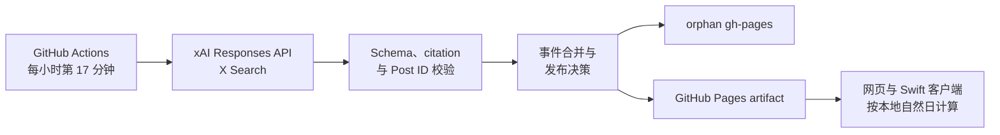

# HasReset 状态服务

`api/hasreset` 是 Codex Runway 的“今日是否重置”静态状态源。它由 GitHub
Actions 定时调用 xAI Responses API，通过 X Search 检索 `@thsottiaux`
最近发布的 Codex 配额信息，将可信结果转换为结构化事件，再发布到 GitHub
Pages。

> 此服务并非官方状态源。结果由 AI 分析，仅供参考；定时任务、上游 API 和
> GitHub Pages 都可能延迟或暂时不可用。

## 工作流程



服务遵循以下边界：

- 每轮最多发起一次 Grok Responses 请求，不重试。
- **默认使用 HTTP** `POST /v1/responses`；仅当 `GROK_USE_WS=true` 时改用
  WebSocket `wss://…/v1/responses`（`response.create` + 等待
  `response.completed`）。
- 仅启用 `x_search`，只允许检索 `@thsottiaux`。
- 搜索最近 48 小时，请求最多两个 X Search 工具调用。
- 兼容代理可将一次 X Search 展开为多个已完成的内部 X 搜索调用。
- 兼容代理也可省略工具调用记录：非空事件须有同 Post ID 的 X citation（`thsottiaux` 或 `i/status`）；空事件可直接作为“无相关公告”。
- 关闭图片和视频理解，设置 `store: false`。
- 只有 citation 与事件中的 X Post ID 匹配时才接受非空事件。
- WebSocket 路径会发送 keepalive ping，降低 Cloudflare 等代理掐断长连接的概率。
- 不发布 X 正文、Grok 原始响应、请求头或密钥。
- 无语义变化时不提交、不部署；UTC 每天最多发布一次健康心跳。

## 目录结构

```text
api/hasreset/
├── public/       # GitHub Pages 页面、样式、本地化与浏览器端判断逻辑
├── schemas/      # Grok Structured Output 与公开 API Schema
├── src/          # 请求、响应校验、事件转换、发布状态与 CLI
├── tests/        # Node 内置测试及 fixtures
├── package.json
└── README.md
```

主要入口为 `src/cli.mjs`。GitHub Actions 调度和 Pages 发布位于仓库根目录的
`.github/workflows/update-hasreset.yml`。

## GitHub 配置

### Actions Secrets / Variables

在仓库的 **Settings → Secrets and variables → Actions** 中配置：

| 名称 | 类型 | 建议值 | 说明 |
| --- | --- | --- | --- |
| `GROK_API_BASE_URL` | Secret | `https://api.x.ai/v1` | 必须使用 HTTPS；可填裸域名或 API 版本目录，不要附加 `/responses` |
| `GROK_MODEL` | Secret | `grok-4.5` | 必须同时支持 Responses API、X Search 和 Structured Outputs |
| `GROK_API_KEY` | Secret | xAI API Console 生成的密钥 | 填写原始密钥，不要添加 `Bearer ` 前缀 |
| `GROK_USE_WS` | **Variable（推荐）** 或 Secret | 留空（默认 HTTP） / `true` | 是否使用 WebSocket 调用 Responses API |

裸域名会自动补为 `/v1/responses`；已经包含版本目录的地址仍按原样使用。当前
Workflow 读取 `GROK_API_BASE_URL`、`GROK_MODEL`、`GROK_API_KEY` 与可选的
`GROK_USE_WS`。即使 Base URL、模型名称和传输开关本身不敏感，也必须使用上述
名称配置，否则运行会进入 `configuration_error`（传输开关缺失时默认 HTTP）。

`GROK_USE_WS` 仅在值为 `true` / `1` / `yes` / `on`（大小写不敏感）时启用
WebSocket；未设置、空字符串或其它值一律走 HTTP。

> **注意：** `GROK_USE_WS` 更推荐配置为 **Actions Variable**，而不是 Secret。
> 若把值 `true` 存成 Secret，GitHub Actions 可能把 job output 中的
> `true` 当作密钥泄漏而丢弃（`Skip output … secret`），导致 `deploy` job
> 被跳过、Pages 不更新。Workflow 已用 `should_publish=yes|no` 规避该问题，
> 但仍建议用 Variable。

不需要配置：

- `GITHUB_TOKEN`：由 GitHub Actions 自动提供。
- PAT：此服务不使用个人访问令牌。
- `OPENAI_API_KEY`、X Cookie 或其他非官方认证信息。

### 仓库设置

1. 在 **Settings → Actions → General → Workflow permissions** 中选择
   **Read and write permissions**。
2. 在 **Settings → Pages → Build and deployment → Source** 中选择
   **GitHub Actions**。
3. 确认默认分支包含 `.github/workflows/update-hasreset.yml`。

## 首次部署

1. 将代码推送到仓库默认分支。
2. 配置三个必需的 Repository Secrets（以及可选的 `GROK_USE_WS`）和上述仓库设置。
3. 打开 **Actions → Update reset-today status → Run workflow**。
4. 确认本次运行只产生一次 Grok 请求（HTTP 或 WebSocket，取决于 `GROK_USE_WS`）。
5. 检查 `gh-pages` 分支及以下地址：
   - 页面：`https://<owner>.github.io/<repository>/`
   - JSON：`https://<owner>.github.io/<repository>/api/status.json`
6. 紧接着再次手动运行。没有事件或页面变化时，不应新增 `gh-pages` 提交或
   Pages 部署。

本仓库的正式地址为：

- `https://licoy.github.io/codex-runway/`
- `https://licoy.github.io/codex-runway/api/status.json`

Swift 客户端当前使用上述正式地址。Fork 如果要改用自己的状态源，需要同步
修改 `RateLimitResetTodayClient` 中的 `siteURL` 和 `statusURL`。

## 调度与发布行为

Workflow 使用：

- cron：`17 * * * *`
- 手动触发：`workflow_dispatch`
- 固定 concurrency group：`update-hasreset`
- 单个 job 超时：最多 5 分钟

以下情况会发布：

- 首次成功检查。
- 事件集合发生语义变化。
- 从降级状态恢复。
- 页面静态资源发生变化。
- 当天尚未发布过健康心跳。
- 首次故障，或安全错误码发生变化。

以下情况不会发布：

- 同一 UTC 日内事件语义未变化。
- 仅置信度发生变化。
- 与已发布状态相同的重复故障。

首次故障会发布一个安全的 `degraded` 状态（仍可能更新 Pages）。重复的同类故障
不会持续制造提交。

Pages 由 `deploy` job（`actions/deploy-pages`）发布，**不是**直接读 `gh-pages`
分支。Workflow 因此拆成两步：

| 标志 | 含义 |
| --- | --- |
| `should_update_branch` | decision 要求 `publish=true` 时更新 `gh-pages`（状态源） |
| `should_deploy` | 需要把当前 site artifact 部署到 GitHub Pages |

`should_deploy=yes` 的条件：

1. decision 要求发布（`publish=true`），或
2. 本轮检查健康（exit `0`，用于自愈：分支已更新但上次 deploy 被跳过），或
3. 手动 `workflow_dispatch` 且勾选 `force_deploy`（默认勾选）

因此：若线上仍是旧页，而 `gh-pages` 已是健康数据，再跑一次成功的 monitor
就会重新 deploy，不必强行制造“事件变化”。

## 公开 API

API v1 的 Schema 位于 `schemas/status.schema.json`。它返回事件列表，不返回统一
的 `yes` 或 `no`，因为“今天”取决于客户端所在地的时区。

```json
{
  "schemaVersion": 1,
  "generatedAt": "2026-07-28T12:00:00.000Z",
  "lastSuccessfulCheckAt": "2026-07-28T12:00:00.000Z",
  "monitor": {
    "status": "ok",
    "errorCode": null
  },
  "events": []
}
```

事件类型：

| `kind` | 含义 | 计作“今日已重置” |
| --- | --- | --- |
| `reset_completed` | 已明确完成配额重置 | 是 |
| `reset_scheduled` | 已明确安排未来重置 | 仅在 `effectiveAt` 已到达且处于本地当天时 |
| `banked_reset` | 存入可用重置次数 | 否 |
| `limit_increase` | 提高配额上限 | 否 |
| `uncertain` | 有关公告无法安全分类 | 当天显示“未知” |

客户端判断顺序：

1. `monitor.status != "ok"` 时显示“未知”。
2. `lastSuccessfulCheckAt` 缺失、无效或距当前超过 30 小时时显示“未知”。
3. 本地当天存在 `uncertain` 时显示“未知”。
4. 本地当天存在已经生效的 `reset_completed` 或 `reset_scheduled` 时显示“是”。
5. 其他情况显示“否”。

`rationale` 是服务根据事件类型生成的固定派生文案，不是模型自由文本，也不包含
X 原文。

## 本地开发

要求 Node.js 20 或更高版本；GitHub Actions 当前使用 Node.js 24。

正式部署的 Base URL 必须使用 HTTPS。本地调试额外允许
`http://localhost`、`http://127.0.0.1` 和 `http://[::1]`，其他 HTTP
地址仍会进入 `configuration_error`。GitHub Actions 无法访问开发机上的
loopback 地址。

### 传输方式

| `GROK_USE_WS` | 传输 | 端点行为 |
| --- | --- | --- |
| 未设置 / `false` / 其它值 | **HTTP（默认）** | `POST https://…/v1/responses`，等待完整 JSON |
| `true` / `1` / `yes` / `on` | WebSocket | `wss://…/v1/responses`，发送 `response.create`，等待 `response.completed` |

当上游挂在 Cloudflare Free 等短超时网关后面时，完整 agentic `x_search`
请求的 HTTP 路径更容易出现 **504**；此时可把 `GROK_USE_WS` 设为 `true`
尝试 WebSocket 长连接。官方直连 `api.x.ai` 时，默认 HTTP 通常即可。

响应既支持官方 `x_search_call`，也兼容标准 Responses 代理常见的
`custom_tool_call` / `function_call` / `tool_call`。兼容调用只接受
`x_search`、`x_keyword_search`、`x_semantic_search`、`x_user_search` 和
`x_thread_fetch`；无论使用哪种调用格式，非空事件都仍须通过 X citation
与 Post ID 校验。部分代理会省略 X Search 调用记录；此时：

- 非空事件：每个事件必须有同 Post ID 的 X citation（`@thsottiaux` 或 `x.com/i/status/<id>`）；
- 空事件：允许作为“最近 48 小时无相关公告”的合法结果；
- 仍拒绝 `web_search` 等非 X 工具调用。

代理若返回缺少 `effectiveAt` 的 `reset_scheduled`，服务会将其安全降级为
`uncertain`，不会当作已经生效的重置。非严格 Structured Output 多出的字段
会被忽略；模型自带的 `rationale` 不会写入公开状态。

运行测试不需要任何 API Key，所有外部响应均来自 fixtures：

```bash
npm test --prefix api/hasreset
```

也可以从服务目录运行：

```bash
cd api/hasreset
npm test
```

手动执行 CLI 时，需要先在当前 shell 中设置 `GROK_*` 环境变量，并使用仓库
之外的临时目录作为输入和输出：

```bash
hasreset_workdir="$(mktemp -d)"
mkdir -p "${hasreset_workdir}/previous"

export GROK_API_BASE_URL="https://api.x.ai/v1"
export GROK_MODEL="grok-4.5"
export GROK_API_KEY="..."
# 可选：遇到 HTTP 网关超时时启用
# export GROK_USE_WS=true

node api/hasreset/src/cli.mjs \
  --previous-dir "${hasreset_workdir}/previous" \
  --output-dir "${hasreset_workdir}/site" \
  --decision-file "${hasreset_workdir}/decision.json"
```

CLI 会真实发起一次可能计费的 Grok 请求。退出码：

- `0`：检查健康，包括无需发布的正常情况。
- `2`：检查降级；生成的 decision 文件仍可用于决定是否发布故障状态。

decision 文件严格包含：

- `publish`：是否应更新 `gh-pages` 并部署。
- `degraded`：本轮是否处于降级状态。
- `errorCode`：安全错误码或 `null`。
- `reason`：内部发布原因，不写入公开 API。

## 安全错误码

| 错误码 | 含义 |
| --- | --- |
| `configuration_error` | Secrets、Base URL、模型或 CLI 参数不合法 |
| `request_failed` | 网络失败、超时或上游返回非成功状态 |
| `invalid_response` | Grok 响应、Structured Output 或公开状态不符合严格格式 |
| `uncited_source` | 事件缺少匹配 citation，或来源账号/Post ID 不一致 |

服务不会将上游响应正文或内部异常详情写入公开状态。

## 隐私与合规边界

- 仅处理公开的 X 动态，不收集用户数据。
- Pages 只托管静态页面和 JSON，不提供认证、交易或通用 SaaS。
- Actions 只承担低频定时分析和静态发布，不作为按请求运行的 serverless 后端。
- 不要直接提高到 5/15 分钟轮询，也不要在未重新评估条款的情况下商业化或改造成
  通用 API。
- GitHub schedule 可能延迟、丢失运行，或因公共仓库长期无活动被停用；客户端的
  30 小时 stale 判断和手动触发是必要的故障边界。

扩大频率、数据来源或服务用途前，应重新核对 GitHub Actions、GitHub Pages 和
xAI API 的现行条款。需要正式 safe harbor 时，应向相应平台支持渠道取得书面
确认。
